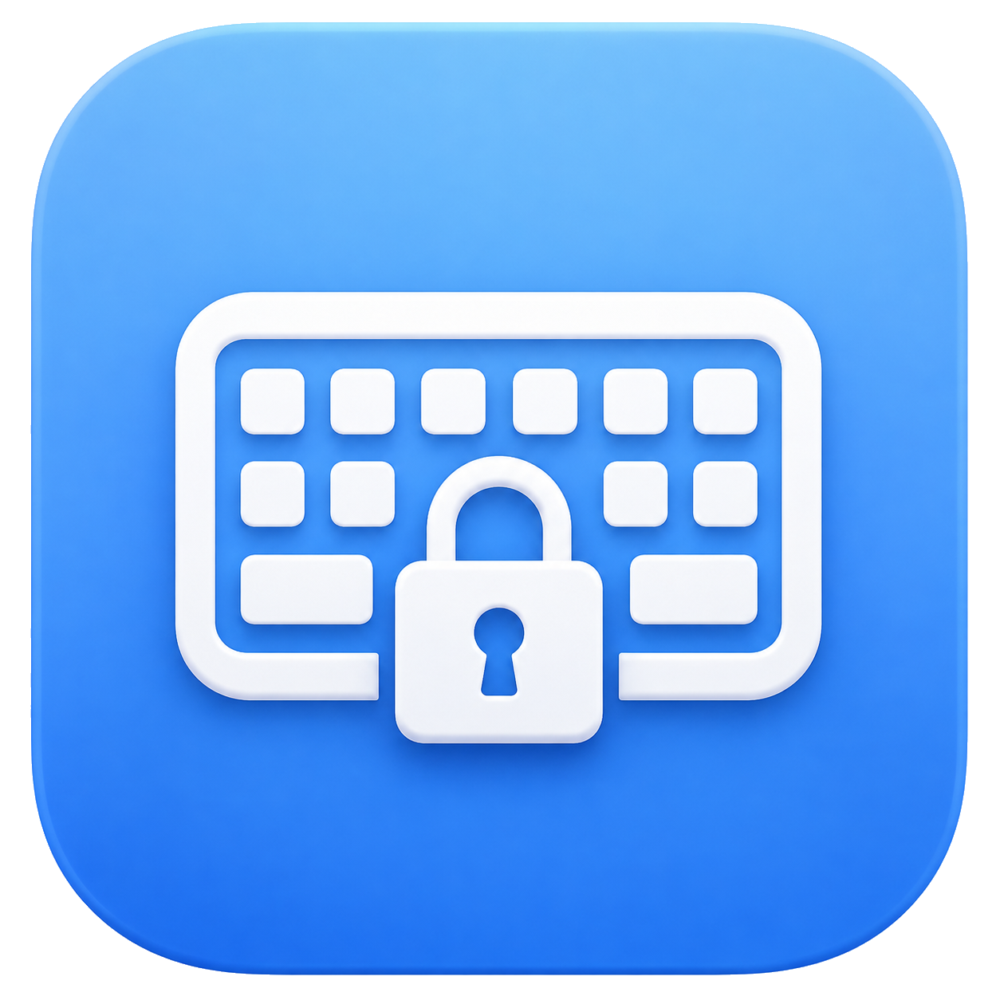

# iBlock

  

**iBlock** è una piccola applicazione gratuita per macOS.

## Download

Scarica l'app già pronta. **Non servono Xcode, Terminale o la compilazione del codice.**

| Il tuo Mac | Download |
| --- | --- |
| Mac con chip **Apple M1, M2, M3, M4 o successivo** |  |
| Mac con processore **Intel** |  |
| Non sai quale scegliere? |  |

> **Non sai che processore possiedi?** Scarica la versione **Universale**: funziona sia sui Mac Intel sia sui Mac Apple Silicon.

[Visualizza tutte le versioni pubblicate](https://github.com/Domenico-lel/bloccotastieramacos/releases)

Dopo il download, apri il file DMG e trascina **iBlock** sull'icona **Applicazioni**. Le istruzioni complete sono disponibili nella sezione [Installazione facile](#installazione-facile).

Serve per disattivare temporaneamente la tastiera, per esempio mentre la pulisci. Quando il blocco è attivo:

- i tasti normali non funzionano;
- i tasti di volume, luminosità e riproduzione vengono bloccati;
- mouse e trackpad continuano a funzionare nella modalità tastiera;
- puoi sbloccare tutto con il pulsante **Sblocca**;
- in emergenza puoi tenere premuto **ESC per 3 secondi**.

Prima del blocco parte un conto alla rovescia di 3 secondi, che puoi annullare. L'icona nella barra dei menu permette inoltre di mostrare l'app, bloccare, sbloccare o uscire in qualsiasi momento usando mouse o trackpad.

La modalità **Pulizia completa** blocca temporaneamente anche mouse e trackpad. Per sicurezza funziona sempre con uno sblocco automatico impostabile a 10, 20, 30 o 60 secondi.

L'app non usa Internet, non raccoglie dati e non contiene pubblicità.

## Compatibilità

Questa versione è compatibile con:

- Mac con processore Intel (`x86_64`);
- Mac con processore Apple Silicon (`arm64`), inclusi M1, M2, M3, M4 e successivi;
- macOS 13 Ventura;
- Mac non ufficialmente supportati che utilizzano OpenCore Legacy Patcher.

## Installazione facile

Non servono Xcode o Terminale. Usa uno dei pulsanti nella sezione [Download](#download) oppure apri la pagina [Releases](https://github.com/Domenico-lel/bloccotastieramacos/releases/latest):

- [Apple Silicon — M1, M2, M3, M4 e successivi](https://github.com/Domenico-lel/bloccotastieramacos/releases/latest/download/iBlock-Apple-Silicon.dmg)
- [Intel](https://github.com/Domenico-lel/bloccotastieramacos/releases/latest/download/iBlock-Intel.dmg)
- [Universale — funziona su entrambi](https://github.com/Domenico-lel/bloccotastieramacos/releases/latest/download/iBlock-Universale.dmg)

Se non sai quale processore possiedi, apri il menu Apple  e scegli **Informazioni su questo Mac**. Se compare **Chip Apple**, scegli Apple Silicon. Se compare **Processore Intel**, scegli Intel. La versione Universale è sempre una scelta sicura.

### Passaggi

1. Scarica uno dei tre file DMG indicati sopra.
2. Apri il file DMG scaricato.
3. Nella finestra che compare, trascina **iBlock** sull'icona **Applicazioni**.
4. Attendi la fine della copia, poi espelli **Installa iBlock** dalla barra laterale del Finder.
5. Apri iBlock dalla cartella Applicazioni e segui la sezione **Primo avvio** qui sotto.

Nella pagina Releases restano disponibili anche i file ZIP per chi li preferisce.

## Compilazione manuale con gli script

Questa procedura è destinata a chi vuole compilare personalmente il codice sorgente.

1. Scarica il codice sorgente da GitHub e apri la cartella.
2. Scegli **build-apple-silicon.command**, **build-intel.command** oppure **build-universal.command**.
3. Fai clic destro sul file scelto e seleziona **Apri**.
4. Se macOS mostra un avviso, premi nuovamente **Apri**.
5. Aspetta che nel Terminale compaia una riga che inizia con **Creata:**.
6. Apri la cartella `build` corrispondente e trascina l'app in Applicazioni.

Al primo utilizzo dello script, macOS potrebbe chiederti di installare gli strumenti Apple. Accetta, attendi la fine dell'installazione e apri nuovamente lo stesso file `.command`.

## Primo avvio

macOS potrebbe bloccare il primo avvio perché l'app non è distribuita tramite App Store.

1. Apri la cartella **Applicazioni**.
2. Fai clic destro su **iBlock**.
3. Seleziona **Apri**.
4. Nella finestra successiva premi ancora **Apri**.

Non è necessario disattivare le protezioni di macOS.

## Autorizzazioni necessarie

L'app ha bisogno dell'autorizzazione Accessibilità per fermare i tasti.

1. Apri **iBlock**.
2. Premi **BLOCCA TASTIERA**.
3. Quando macOS mostra la richiesta, apri **Impostazioni di Sistema**.
4. Vai in **Privacy e sicurezza**.
5. Apri **Accessibilità**.
6. Attiva l'interruttore accanto a **iBlock**.
7. Se l'app non compare, premi il pulsante `+` e selezionala dalla cartella Applicazioni.
8. Controlla anche **Privacy e sicurezza > Monitoraggio input** e abilita l'app se richiesto.
9. Chiudi completamente iBlock e riaprila.

Queste autorizzazioni permettono soltanto all'app di intercettare i tasti. L'app non registra e non salva ciò che digiti.

## Come si usa

1. Apri **iBlock**.
2. Premi **BLOCCA TASTIERA**.
3. Attendi il conto alla rovescia di 3 secondi. Premi **Annulla** se hai cambiato idea.
4. Pulisci la tastiera usando il mouse o il trackpad quando necessario.
5. Clicca **Sblocca** per riattivare i tasti.

Se non riesci a premere il pulsante, tieni premuto il tasto **ESC per 3 secondi**.

Puoi anche usare l'icona nella barra dei menu, nella parte superiore dello schermo:

- **Mostra iBlock** riapre la finestra;
- **Blocca tastiera…** avvia il conto alla rovescia;
- **Sblocca** riattiva immediatamente i tasti;
- **Esci** chiude l'app e assicura lo sblocco della tastiera.

## Pulizia completa: tastiera e trackpad

Questa modalità serve quando vuoi pulire anche il trackpad.

1. Seleziona **Blocca anche mouse e trackpad**.
2. Scegli una durata: 10, 20, 30 oppure 60 secondi.
3. Premi **AVVIA PULIZIA COMPLETA**.
4. Durante i 3 secondi iniziali puoi ancora premere **Annulla**.
5. Dopo il blocco, aspetta il tempo mostrato nella finestra.
6. Tastiera e puntatore si riattiveranno automaticamente.

Durante la pulizia completa il cursore viene scollegato temporaneamente dai dispositivi di puntamento. Vengono bloccati sia il trackpad sia eventuali mouse collegati, compresi clic, movimento, scorrimento e gesti. Non è possibile usare il pulsante o il menu mentre il puntatore è bloccato. Se devi interrompere prima del termine, tieni premuto **ESC per 3 secondi**.

Per sicurezza, la modalità completa non permette un blocco senza timer. Anche la chiusura o l'arresto dell'app rimuovono il filtro degli eventi.

## Aggiornare l'app

1. Chiudi la versione attuale.
2. Scarica la nuova versione dalla sezione [Download](#download).
3. Trascina la nuova **iBlock.app** nella cartella Applicazioni.
4. Quando Finder lo chiede, seleziona **Sostituisci**.

Se possiedi una versione precedente chiamata **Blocco Tastiera.app**, elimina quella vecchia dopo aver installato **iBlock.app**. Il cambio di nome può richiedere di concedere nuovamente le autorizzazioni indicate qui sotto.

Dopo un aggiornamento, macOS potrebbe chiedere nuovamente le autorizzazioni. In questo caso:

1. Vai in **Privacy e sicurezza > Accessibilità**.
2. Seleziona la vecchia voce **iBlock** e premi `-`.
3. Premi `+` e aggiungi la nuova app dalla cartella Applicazioni.
4. Ripeti gli stessi passaggi in **Monitoraggio input**, se necessario.

## Problemi comuni

### La cartella build non compare

La compilazione non è terminata correttamente. Leggi il messaggio nel Terminale e verifica che compaia la scritta **Creata:**. La frase **Processo completato** da sola non indica necessariamente che l'app sia stata creata.

### L'icona dell'app mostra un simbolo di divieto

L'app è incompleta oppure non è compatibile con il Mac. Elimina quella copia e avvia nuovamente lo script corretto per il tuo processore. Se vuoi evitare errori di architettura, usa **build-universal.command**.

### L'app continua a chiedere l'autorizzazione

Rimuovi la vecchia voce da Accessibilità con il pulsante `-`, poi aggiungi nuovamente l'app presente nella cartella Applicazioni usando il pulsante `+`. Assicurati che l'interruttore sia acceso.

### I tasti non vengono bloccati

Controlla che iBlock sia abilitata sia in **Accessibilità** sia, quando presente, in **Monitoraggio input**. Poi chiudi e riapri l'app.

## Disinstallazione

1. Chiudi iBlock.
2. Sposta **iBlock.app** dalla cartella Applicazioni al Cestino.
3. Rimuovi la sua voce da Accessibilità e Monitoraggio input.

L'app non installa servizi, estensioni o altri componenti nel sistema.

## Compilazione con Xcode

Questa sezione è destinata agli sviluppatori.

1. Apri `KeyboardLock.xcodeproj` con Xcode 14.1 o successivo.
2. Seleziona lo schema **KeyboardLock**.
3. Seleziona **My Mac** come destinazione.
4. Usa **Product > Build** oppure **Product > Archive**.

Il progetto utilizza Swift e AppKit, ha deployment target macOS 13 ed è configurato per le architetture `x86_64` e `arm64`. Non utilizza dipendenze esterne.

## Privacy e sicurezza

- Nessuna connessione di rete.
- Nessuna telemetria.
- Nessuna pubblicità.
- Nessuna raccolta o memorizzazione dei tasti premuti.
- Nessuna dipendenza esterna.
- Codice sorgente disponibile nel progetto.

Il blocco funziona nella sessione dell'utente. Alcune funzioni gestite direttamente dall'hardware o dal sistema operativo potrebbero non essere intercettabili.
